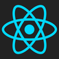

#   

  <a href="#installation">Installation</a> |
  <a href="#licenses">License</a>
    
  <blockquote>
  	React TodoMVC Example, taken from https://github.com/tastejs/todomvc with graphql addition
	
	React is a JavaScript library for creating user interfaces. Its core principles are declarative code, efficiency, and flexibility. Simply specify what your component looks like and React will keep it up-to-date when the underlying data changes.
  </blockquote>

Installation
------------
* Install https://github.com/AdhityaRamadhanus/express-graphql-something , this graphql server will be the backend
* git clone https://github.com/AdhityaRamadhanus/todomvc-react-graphql.git
* cd todomvc-react-graphql
* npm install
* npm i -g budo (if you don't have budo installed, check here for documentation https://www.npmjs.com/package/budo)
* npm start

## License

Everything in this repo is MIT License unless otherwise specified.

MIT © Adhitya Ramadhanus.
